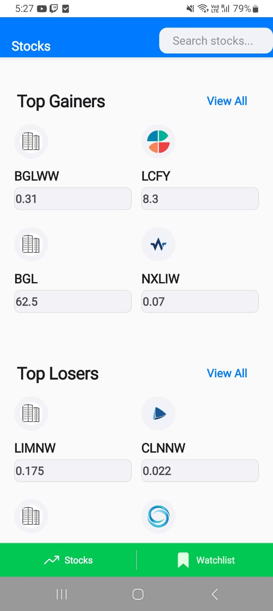
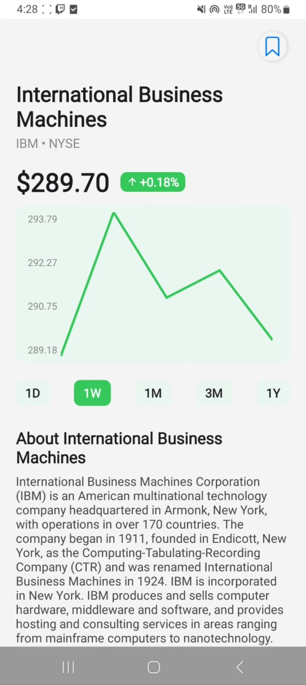
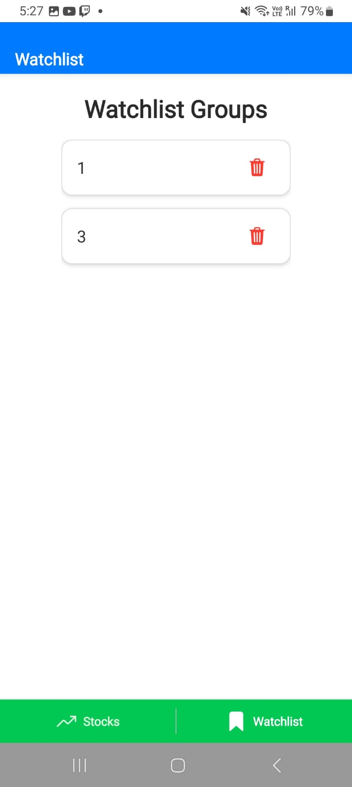

## Stocks & ETFs App (Expo + React Native)

An Expo Router app for exploring stocks and ETFs, viewing top gainers/losers, detailed company pages with lightweight charts, global search, and a grouped watchlist. Data is sourced from Alpha Vantage and basic logos/price fallbacks from Financial Modeling Prep.

### Highlights

- Expo SDK 53, React Native 0.79, React 19, Expo Router 5
- Home: Top Gainers/Losers with quick navigation to details and “View all”
- Global Search: Debounced symbol search (Alpha Vantage), overlay results, logo prefetch
- Details: Company overview, simple line chart across timeframes (1D, 1W, 1M, 3M, 1Y)
- Watchlist: Create groups, add/remove symbols, persist via AsyncStorage
- Caching: 24h on top gainers/losers and time series via AsyncStorage
- Android, Web support (iOS build via EAS on macOS or CI)


## Contents

- Getting started
- API keys and configuration
- Project structure
- Libraries & techniques used
- Core features and UX
- Build and deploy (EAS)
- Demo video
- Download APK
- Screenshots
- Troubleshooting & notes
- License


## Getting started

Prerequisites:

- Node.js 18+ and npm
- Expo CLI (comes via `npx expo`), optional: EAS CLI for builds

Install dependencies:

```powershell
npm install
```

Start the dev server (choose Android device, emulator, or web):

```powershell
npm run start
```

Convenience scripts:

```powershell
# Open on Android (if Android Studio/emulator or device is connected)
npm run android

# Open in a browser
npm run web
```

## Project structure

```
app/
	(app)/
		_layout.tsx        # Tabs, custom header with global search
		index.tsx          # Home (Explore): Top gainers/losers + search overlay
		watchlist.tsx      # Grouped watchlist backed by AsyncStorage
	api/
		alphaVantage.js    # Alpha Vantage API calls + 24h caching helpers
		SearchContext.tsx  # Global search state (value, show/hide)
	details/
		[symbol].tsx       # Company overview + timeframe chart + add to watchlist
	view-all/
		[type].tsx         # Paginated lists for gainers/losers (View all)
assets/images/         # Icons, splash, screenshots, placeholder logo
app.json               # Expo app config
eas.json               # EAS build profiles
eslint.config.js       # ESLint config (Expo preset)
package.json           # Scripts and dependencies
tsconfig.json          # Strict TS config, typed routes enabled
```

Key dependencies:

- expo, expo-router, expo-constants, expo-splash-screen, expo-status-bar
- @react-native-async-storage/async-storage for caching and watchlists
- @expo/vector-icons, react-native-svg (charts), use-debounce


## Libraries & techniques used

**Libraries:**
- expo, expo-router: runtime, routing, tabs
- @react-native-async-storage/async-storage: caching, watchlists
- use-debounce: debounced search input
- react-native-svg: custom line chart
- @expo/vector-icons: icons
- react-native-safe-area-context: safe layouts
- react-native-gesture-handler, react-native-screens, react-native-reanimated: navigation

**Techniques:**
- Debounced global search overlay (Alpha Vantage `SYMBOL_SEARCH`)
- Prefetch multiple logo URLs per symbol; fallback to placeholder
- AsyncStorage caching (24h TTL) for gainers/losers and time series
- Defensive API data mapping; handles missing fields
- Generic time series parsing and resampling
- Custom chart: scaled points, y-axis ticks, up/down color
- Watchlist: create/delete groups, toggle symbols, persisted
- Responsive UI: overlay sizing, compact grids
- Watchlist pricing: cached gainers/losers, FMP fallback


## Core features and UX

### Home (Explore)

- Fetches top gainers/losers via Alpha Vantage `TOP_GAINERS_LOSERS` and caches results for 24 hours.
- Displays a compact matrix of 4 gainers and 4 losers with ticker, price, and logo.
- “View all” leads to paginated lists for the selected category.
- Global search in the header opens an overlay when typing; results use `SYMBOL_SEARCH` and show logo + name.

Image handling:

- For a symbol it tries multiple logo URL variants: `SYMB`, `SYMB.SFX`, `SYMB-SFX` etc. via Financial Modeling Prep image endpoint and prefetches a few candidates.
- Fallback to `assets/images/stock-placeholder.png` when none load.

### Details page

- Company overview via Alpha Vantage `OVERVIEW`.
- Lightweight line chart using `react-native-svg`. Time series loaded and cached:
	- Intraday (5min)
	- Daily, Weekly, Monthly
- Timeframe tabs: 1D, 1W, 1M, 3M, 1Y; chart computes pct change and colors up/down.
- Add to watchlist: modal to create groups and toggle current symbol membership.

### Watchlist

- Groups stored in AsyncStorage under key `WATCHLIST_GROUPS`.
- Group list view with delete, and per-group grid of symbols.
- Prices best-effort sourced from cached gainers/losers; if missing, falls back to FMP `quote-short` (no key required) for a quick last price.


## Build and deploy (EAS)

This repo includes `eas.json` profiles for development, preview, and production.

Install EAS CLI (optional, global):

```powershell
npm install -g eas-cli
```

Login and configure your project (one-time):

```powershell
eas login
eas whoami
```

Build:

```powershell
# Development build (internal distribution)
eas build --profile development --platform android

# Production build
eas build --profile production --platform android
```

Submit to store (after a production build):

```powershell
eas submit --platform android --profile production
```

Notes:

- On Windows, Android builds are supported locally and via EAS cloud. iOS builds require macOS or EAS cloud.
- Update `app.json` identifiers before publishing. Android package: `com.madhav222.Groww_assignment`.


## Demo video

- Watch on Google Drive: https://drive.google.com/file/d/1f7WD8S13kN3fqbKB-erU-UaoHI-wSTGw/view?usp=sharing


## Download APK

- Android APK (Google Drive): https://drive.google.com/file/d/1ruu94yaoNVRuv2JaYrLH2WHe37SaNovv/view?usp=sharing
- Note: If Drive requests access, ensure the link is shared publicly or request access from the owner.


## Screenshots

> Images are under `assets/images/`.








## Troubleshooting & notes

- Alpha Vantage rate limits: If you see incomplete data or errors, wait a minute or reduce navigation that triggers many calls; cached data will be reused for 24h.
- Logos missing: Some tickers lack logos on FMP; the app shows a placeholder.
- Web support: The UI aims to be responsive; some native modules fall back gracefully on web.
- Clearing caches: Remove AsyncStorage keys like `gainersLosersCache` and `av_timeseries_*` if you need a fresh fetch.
- Security: Don’t ship a hard-coded API key. Use EAS secrets or a safer mechanism for production.


